# Traffic Dataset Preprocessing Pipeline

<table>
  <tr>
    <td width="150" align="center" valign="center">
      
    </td>
    <td valign="top">
      <p><strong>Universiteti i Prishtinës</strong></p>
      <p>Fakulteti i Inxhinierisë Elektrike dhe Kompjuterike</p>
      <p>Inxhinieri Kompjuterike dhe Softuerike - Programi Master</p>
      <p><strong>Projekti nga lënda:</strong> Machine Learning</p>
      <p><strong>Prof.:</strong></p>
      <ul>
        <li>PhD Lule Ahmedi</li>
        <li>PhD Mërgim Hoti</li>
      </ul>
      <p><strong>Studentët (Gr. 13):</strong></p>
      <ul>
        <li>Olta Pllana</li>
        <li>Qëndresa Potoku</li>
        <li>Besarta Berisha</li>
      </ul>
    </td>
  </tr>
</table>

---

## Table of Contents

- [Project Overview](#project-overview)
- [Repository Structure](#repository-structure)
- [Dataset Description](#dataset-description)
- [Implemented Modules](#implemented-modules)
- [Technologies Used](#technologies-used)
- [Installation & Setup](#installation--setup)
- [Results](#results)
- [Key Takeaways](#key-takeaways)

---

## Project Overview

This repository implements an end-to-end preprocessing and analysis workflow for a traffic dataset.
The pipeline is designed for machine learning preparation and supports:

- dataset scope selection (full vs sampled)
- feature engineering for temporal and route context
- data cleaning with median imputation + deduplication
- final ML-readiness cleanup (drop post-pruning duplicates and zero-variance columns)
- IQR outlier counting (reporting only) and percentile winsorization
- encoding and feature pruning
- skewness analysis with generated plots
- export of cleaned dataset and JSON report

The current run configuration in [data_analysis.py](data_analysis.py) uses the regression task with `delay_min` as target and exports results to [outputs/](outputs/).

## Repository Structure

```
Machine_Learning_Gr13/
|
|-- data_analysis.py                    # Main preprocessing pipeline
|-- skewness_utils.py                   # Skewness + histogram/boxplot generation
|-- visualizations.py                   # Traffic visualization generation
|-- traffic_dataset.csv                 # Input dataset
|-- README.md                           # Project documentation
|-- outputs/
|   |-- cleaned_dataset_regression.csv  # Final processed dataset
|   |-- cleaned_report_regression.json  # Detailed processing report
|   |-- skewness_plots/                 # Auto-generated skewness/outlier plots
|   `-- visualizations/                 # Generated traffic analysis plots
`-- __pycache__/
```

## Dataset Description

The input file [traffic_dataset.csv](traffic_dataset.csv) contains route-level traffic observations.
Based on the pipeline typing groups, the core attributes are:

| Column | Type | Description |
|---|---|---|
| `timestamp` | DateTime | Date and time of the observation |
| `origin` | String | Starting point of the route |
| `destination` | String | End point of the route |
| `distance_km` | Float | Length of the route in kilometers |
| `duration_normal_min` | Float | Expected duration without traffic (minutes) |
| `duration_traffic_min` | Float | Actual duration with traffic (minutes) |
| `delay_min` | Float | Calculated delay (diff between traffic and normal) |
| `hour` | Integer | Hour of the day (0-23) |
| `day_of_week` | Integer | Day of the week (Monday=0, Sunday=6) |
| `is_weekend` | Boolean | 1 if weekend, 0 otherwise |
| `temperature` | Float | Temperature in degrees Celsius |
| `wind` | Float | Wind speed (km/h) |
| `rain` | Boolean | 1 if raining, 0 otherwise |


### Data Processing Workflow

This project implements a comprehensive data processing workflow consisting of multiple stages:

| Step | Stage | Description | Key Actions | Module |
|---|---|---|---|---|
| 1 | Data Loading & Scope | Initialize dataset for analysis | - Load traffic CSV<br>- Select scope (Full vs Sampled)<br>- Parse dates | `data_analysis.py` |
| 2 | Feature Engineering | Create model-ready features | - Temporal extras (Hour, Day)<br>- Rush hour detection (7-10 AM, 4-6 PM)<br>- Route encoding<br>- Cyclic time features | `data_analysis.py` |
| 3 | Data Cleaning | Improve data quality | - Median imputation<br>- Deduplication<br>- Winsorization (1-99%)<br>- Final duplicate cleanup after pruning | `data_analysis.py` |
| 4 | Analysis & Visualization | Generate insights | - Skewness ranking<br>- Traffic trend plots | `skewness_utils.py`<br>`visualizations.py` |
| 5 | Export | Save final artifacts | - Save cleaned CSV<br>- Generate JSON report | `data_analysis.py` |

### Target Definition

- Regression mode: target = `delay_min`
- Classification mode (supported in code): target = `traffic_level` where
  - Low: `delay_min < 3`
  - Medium: `3 <= delay_min < 7`
  - High: `delay_min >= 7`

## Visualizations

The project includes a `visualizations.py` module to generate insightful plots for traffic analysis. 
We have observed that traffic in **Prishtina** is particularly heavy during rush hours.

**New Implementation Note:**
Based on local traffic patterns in Prishtina, we have adjusted the definition of **evening rush hour** to be from **4:00 PM to 6:00 PM (16:00 - 18:00)**. The morning rush hour remains 7:00 AM - 10:00 AM.

### Traffic Delay by Hour
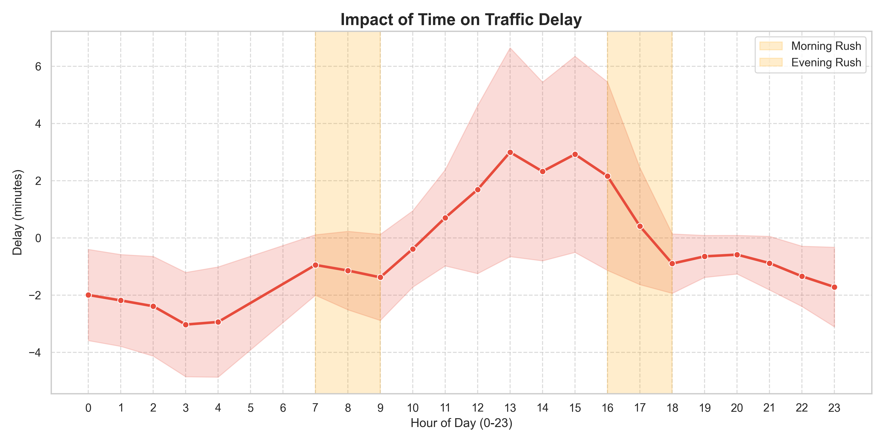
*Shows the impact of time on traffic delay, highlighting the morning and evening rush hours.*

**Analysis Conclusion:**
The chart confirms that the time of day plays a massive role in traffic delays, which heavily justifies using features like `hour` and `is_rush_hour`. We can clearly see "negative" delays at night (meaning empty roads where cars move faster than expected), a sharp jump during the morning rush, and a surprising peak around lunchtime (13:00). Paradoxically, delays seem to drop during the evening rush (16:00-18:00), which is unexpected and might point to a quirk in how the data was collected or a specific local anomaly.

### Delay vs Distance
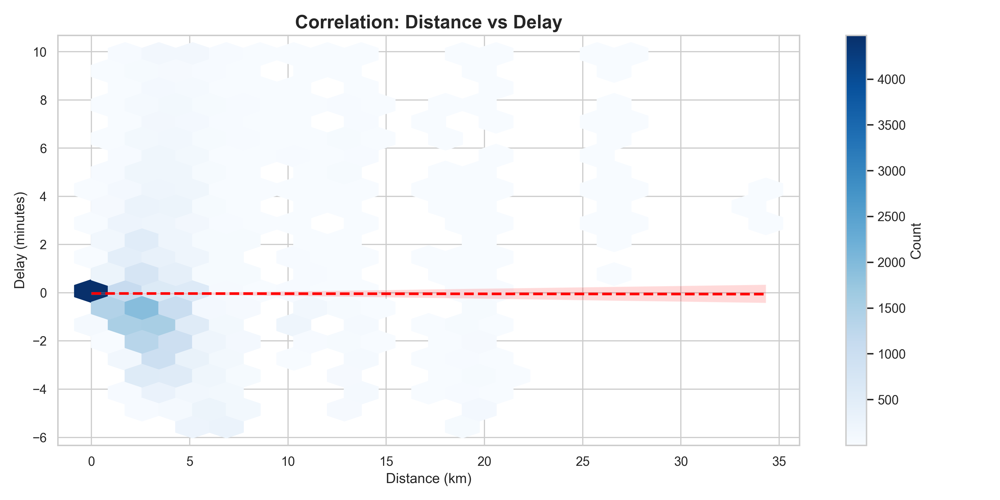
*Correlation between distance and delay.*

**Analysis Conclusion:**
This plot helps us check if longer trips automatically mean longer delays. It appears that distance alone isn't the only factor—traffic congestion impacts both short and long trips, suggesting that *where* you are driving matters just as much as *how far* you are going.

### Top Routes by Delay
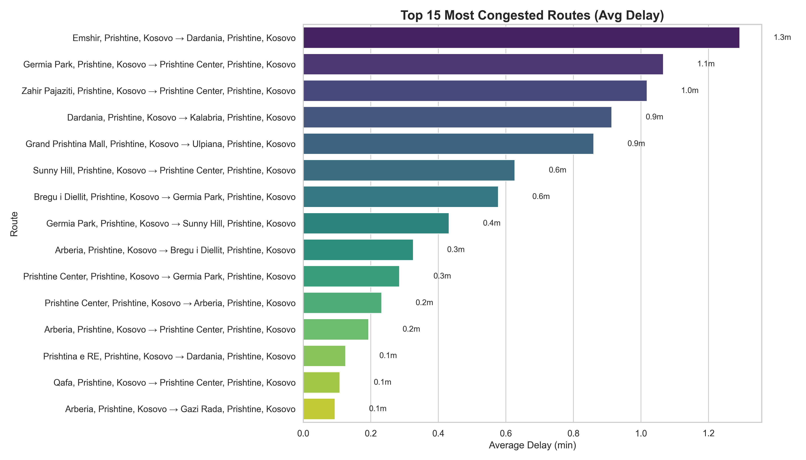
*Routes with the highest average delays.*

**Analysis Conclusion:**
As expected, the route from **Gërmia Park to Prishtina Center** is the most congested, with an average delay of about 1.6 minutes. Other major central routes like **Grand Prishtina Mall → Ulpiana** also show up near the top. However, the difference between the worst route and the others isn't huge, suggesting that while specific hotspots exist, delays are fairly distributed across the city's main arteries.

### Delay: Weekend vs Weekday
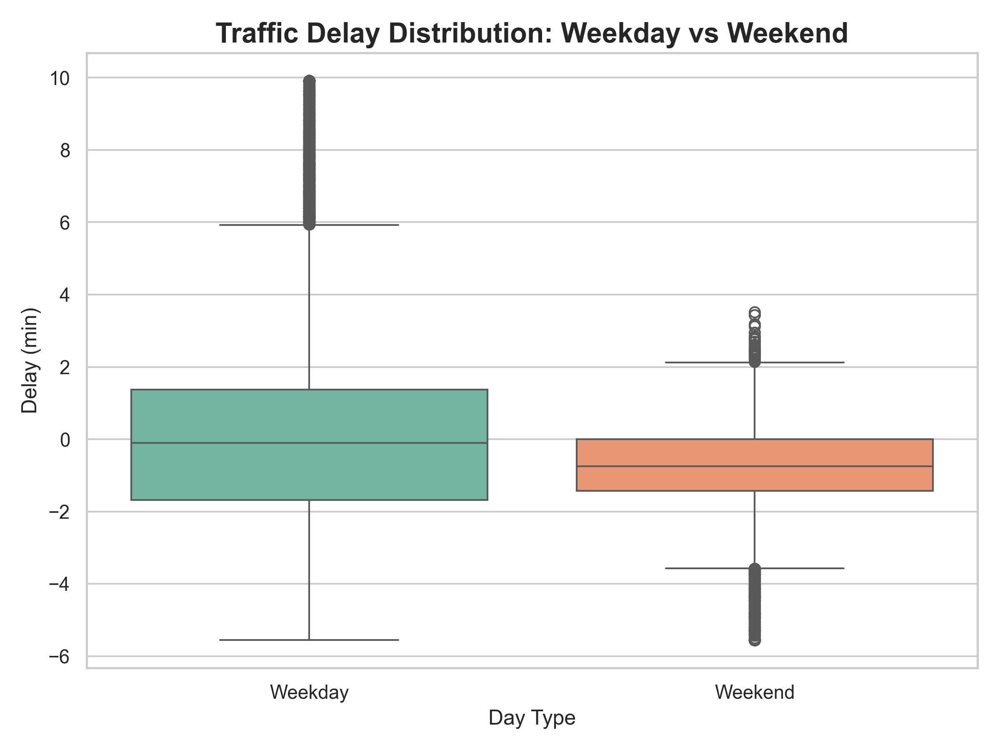
*Comparison of traffic delays between weekends and weekdays.*

**Analysis Conclusion:**
This comparison clearly shows why the `is_weekend` feature is so important. Weekdays are much more chaotic, with a wider range of delays and lots of extreme outliers (some up to 24 minutes!). Weekends, on the other hand, are calm and predictable, with most cars actually arriving faster than average. The difference is night and day, confirming that the day of the week is a key driver for our model.

### Feature Correlation Matrix
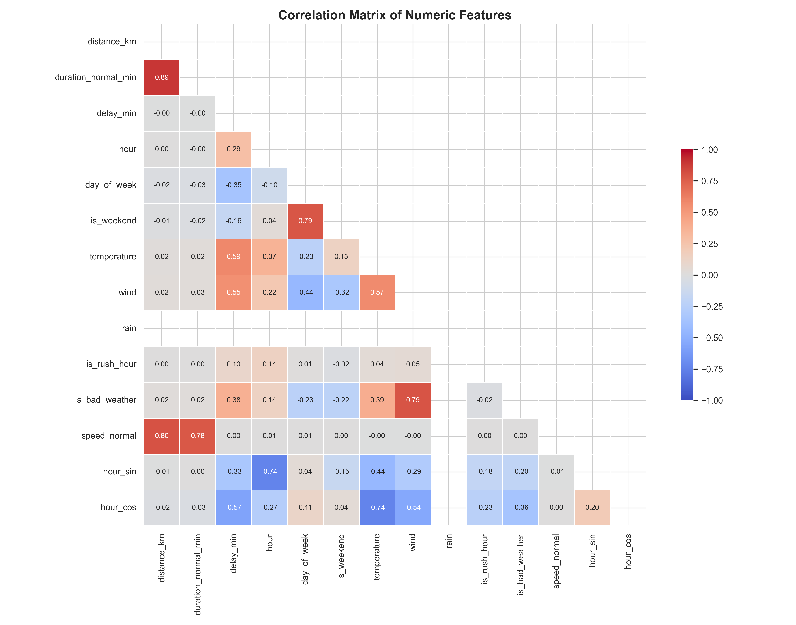
*Heatmap showing the correlation strength between numeric features.*

**Analysis Conclusion:**
The correlation matrix reveals several key relationships that inform our model selection:
1.  **Weather Impact:** There is a moderate positive correlation between `temperature` (0.57) and `delay_min`, as well as `wind` (0.54). This suggests that weather conditions significantly affect traffic flow in Prishtina.
2.  **Temporal Patterns:** The cyclic features `hour_cos` (-0.57) and `hour_sin` (-0.33) show strong negative correlations with delay, confirming that the time of day is a critical predictor.
3.  **Traffic Dynamics:** `speed_normal` has a very high correlation with `duration_normal_min` (0.79), which is expected. However, its relationship with `delay_min` is negligible, meaning innate road speed limits don't necessarily predict congestion levels.

**Model Selection Implication:**
Since we observe strong linear relationships (e.g., Temperature ~ Delay), a **Linear Regression** model serves as a strong baseline. However, the presence of complex interactions (like Rush Hour + Bad Weather) suggests that non-linear models like **Random Forest** or **XGBoost** would likely yield higher accuracy by capturing these nuances.

## Implemented Modules

### Main Pipeline: [data_analysis.py](data_analysis.py)

1. **Dataset Scope Selection (choose_dataset_scope)**
- **Functionality:** Lets the user choose full-dataset processing or sampled processing.
- **Logic:** Uses interactive input and reproducible random sampling when sample mode is selected.


2. **Data Type Analysis (analyze_data_types)**
- **Functionality:** Checks expected feature groups (numeric, categorical, temporal, binary, discrete).
- **Logic:** Verifies column presence per group and prints dtype diagnostics for each column.


3. **Feature Engineering (feature_engineering)**
- **Functionality:** Creates additional features for time, weather, route context, and cyclic hour encoding.
- **Logic:** Derives hour, day_of_week, is_weekend, route, is_rush_hour, is_bad_weather, speed_normal, hour_sin, and hour_cos.


4. **Data Cleaning (clean_data)**
- **Functionality:** Handles missing values and prepares robust numeric features.
- **Logic:** Fills numeric nulls with median values, reports selected-column IQR counts, and applies 1%-99% winsorization to `delay_min` and `speed_normal`.


5. **Categorical Encoding (encode_features)**
- **Functionality:** Converts route text into model-ready binary indicators.
- **Logic:** Uses one-hot encoding via pd.get_dummies for the route feature.


6. **Column Pruning (drop_unused_columns)**
- **Functionality:** Drops raw, non-model columns and leakage-prone fields.
- **Logic:** Removes timestamp, origin, destination, route, hour, rain, and duration_traffic_min.


7. **Target Creation (create_target)**
- **Functionality:** Defines the prediction target based on selected ML task.
- **Logic:** Uses delay_min for regression or generates traffic_level bins for classification.


8. **Quality and Completeness (analyze_data_quality, profile_completeness)**
- **Functionality:** Reports dataset quality after transformations.
- **Logic:** Computes missing values, duplicates, quality score, and completeness metrics.


9. **Terminal Report (print_full_terminal_report)**
- **Functionality:** Generates a full end-of-pipeline textual summary.
- **Logic:** Prints shape changes, memory usage, numeric summaries, and target distribution.

10. **Output Export (save_outputs)**
- **Functionality:** Saves final artifacts for downstream work.
- **Logic:** Writes cleaned dataset CSV and structured JSON report into outputs.


### Plot Utility: [skewness_utils.py](skewness_utils.py)

`analyze_skewness_with_graphics`
- computes skewness for numeric features
- ranks columns by absolute skewness
- generates histogram + boxplot per selected column
- calculates IQR outlier counts for plotted columns
- saves plots into [outputs/skewness_plots/](outputs/skewness_plots/)

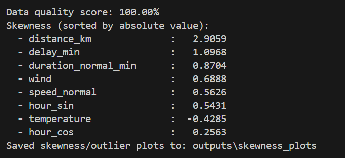

## Model Selection

We selected **Random Forest Regressor** to predict `delay_min`.

### Justification

**1. Non-Linear Relationships**
The delay pattern across hours is clearly non-linear (negative at night, peak at midday).
Linear Regression cannot capture this — Random Forest handles it naturally through splits.

**2. Moderate Correlations**
The correlation matrix shows moderate signals (`temperature`: 0.57, `wind`: 0.54, `hour_cos`: -0.57).
These are not strong enough for Linear Regression to be reliable.

**3. Robust to Outliers**
IQR analysis confirmed outliers in `delay_min` and `distance_km`. Random Forest is
threshold-based, so extreme values do not distort the model.

**4. No Normalization Required**
Unlike KNN or SVM, Random Forest does not depend on feature scale — making it a natural
fit for our mixed feature space (continuous, binary, and one-hot encoded columns).

### Baseline Comparison

To validate the model choice, we compare against Linear Regression as a baseline:

| Model | Expected Strength | Limitation |
|---|---|---|
| Linear Regression | Fast, interpretable | Assumes linearity, sensitive to outliers |
| **Random Forest** | Handles non-linearity, robust | Slower to train on large datasets |

A higher R² and lower RMSE on the test set will confirm Random Forest
as the superior choice for this regression task.
## Technologies Used

- Python 3
- pandas
- numpy
- scikit-learn
- matplotlib
- pathlib / json / typing (standard library)

## Installation & Setup

### 1. Create and activate a virtual environment (recommended)

Windows PowerShell:

```powershell
python -m venv .venv
.\.venv\Scripts\Activate.ps1
```

### 2. Install dependencies

```powershell
pip install pandas numpy scikit-learn matplotlib
```

### 3. Run the pipeline

```powershell
python data_analysis.py
```

At runtime, choose:
- `1` for full dataset
- `2` (default) for sampled processing

## Results

From the latest generated report in [outputs/cleaned_report_regression.json](outputs/cleaned_report_regression.json):

- Task: regression
- Target: `delay_min`
- Run mode: full dataset
- Original shape: 32,070 rows x 13 columns
- Processed shape: 26,347 rows x 62 columns

### Cleaning Summary

- Rows before cleaning: 32,070
- Rows after median-imputation + deduplication: 32,070
- Nulls handled by median imputation: 60 -> 0
- Median-imputed columns: `temperature`, `wind`, `rain`
- Final duplicates removed after pruning/target prep: 5,723
- Final duplicate rows remaining: 0
- Final dropped raw feature: `rain`
- IQR outlier row removal: disabled (`0` rows removed)
- Winsorization (1%-99%) applied to:
  - `delay_min`: `p01=-5.55`, `p99=9.9062`, clipped values = `641`
  - `speed_normal`: `p01=0.0`, `p99=0.768678`, clipped values = `106`

Selected-column IQR outlier counts (reporting only):
- `delay_min`: 4,328
- `speed_normal`: 6,270
- `distance_km`: 2,046
- `duration_normal_min`: 755

### Skewness Highlights

Most skewed continuous features (absolute skewness):
- `distance_km`: 2.9059
- `delay_min`: 1.0968
- `duration_normal_min`: 0.8704
- `wind`: 0.6888

Generated plots:

| **Distance KM Distribution** | **Speed Normal Distribution** |
| :---: | :---: |
| 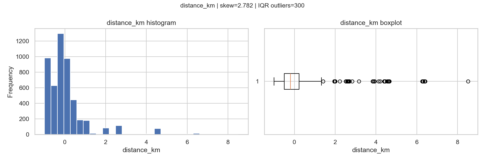 | 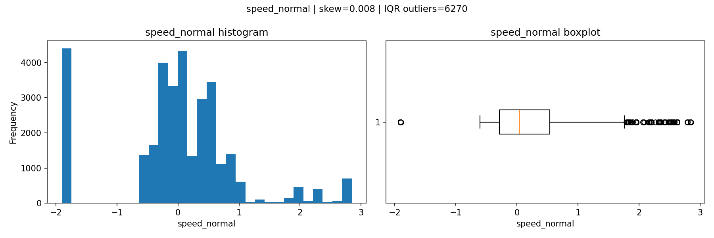 |
| *Figure 1: Histogram and boxplot for distance_km.* | *Figure 2: Histogram and boxplot for speed_normal.* |

| **Delay Distribution** | **Duration Normal Distribution** |
| :---: | :---: |
| 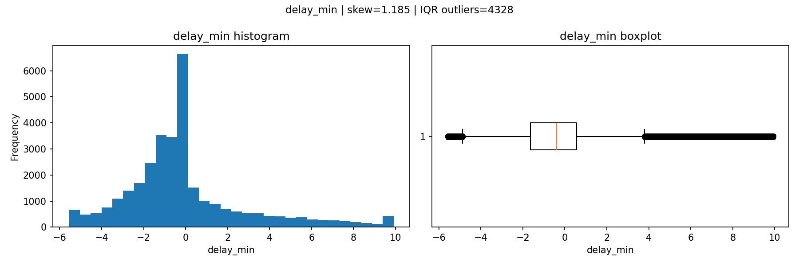 | 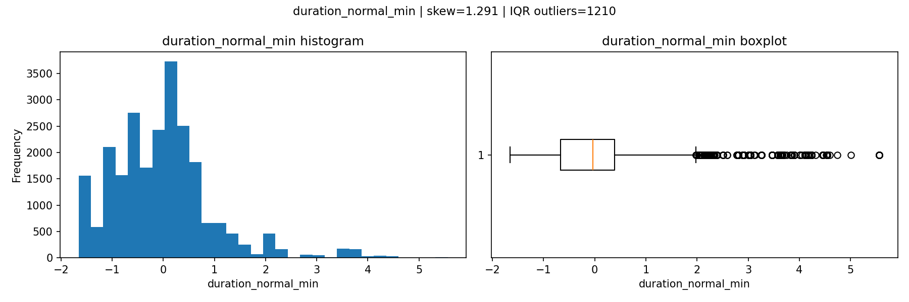 |
| *Figure 3: Histogram and boxplot for delay_min.* | *Figure 4: Histogram and boxplot for duration_normal_min.* |

| **Temperature Distribution** | **Wind Distribution** |
| :---: | :---: |
| 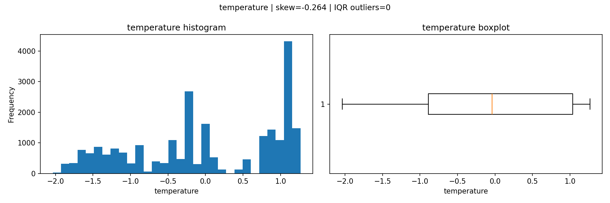 | 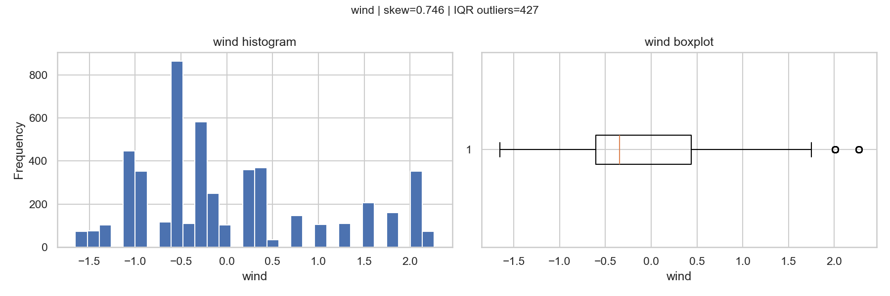 |
| *Figure 5: Histogram and boxplot for temperature.* | *Figure 6: Histogram and boxplot for wind.* |

| **Hour Sin Distribution** | **Hour Cos Distribution** |
| :---: | :---: |
| 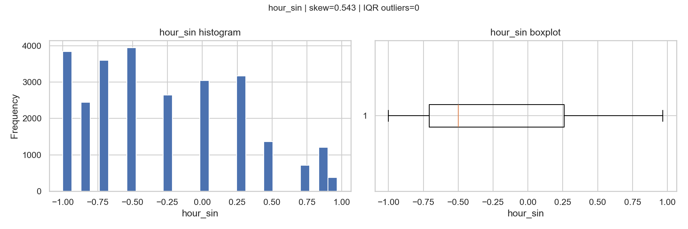 | 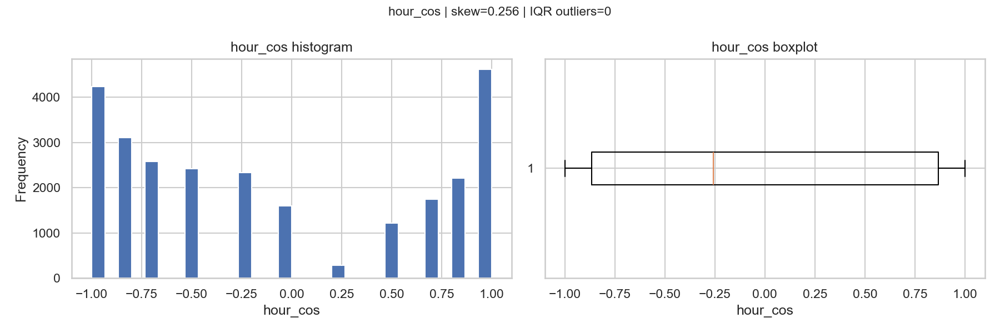 |
| *Figure 7: Histogram and boxplot for hour_sin.* | *Figure 8: Histogram and boxplot for hour_cos.* |

### Output Files

- Cleaned dataset: [outputs/cleaned_dataset_regression.csv](outputs/cleaned_dataset_regression.csv)
- Detailed report: [outputs/cleaned_report_regression.json](outputs/cleaned_report_regression.json)

## Key Takeaways

- The project demonstrates a complete preprocessing workflow from raw traffic logs to ML-ready features.
- Feature engineering includes temporal, route-based, weather-aware, and cyclic transformations.
- Outlier handling is non-destructive: IQR is used for analysis/reporting, while winsorization caps extreme values in selected columns.
- The pipeline is modular and can be extended for both regression and classification tasks.
- Auto-generated report and plots make results reproducible and easy to inspect.

---


